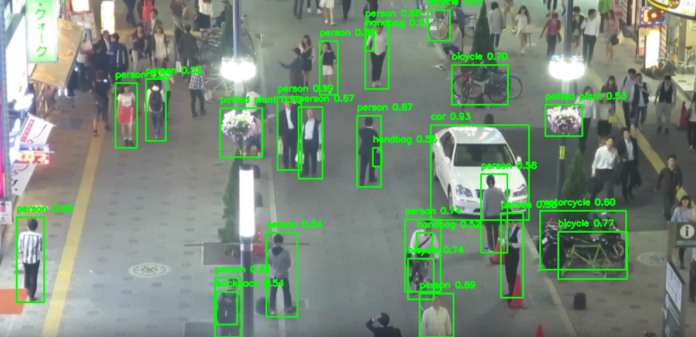
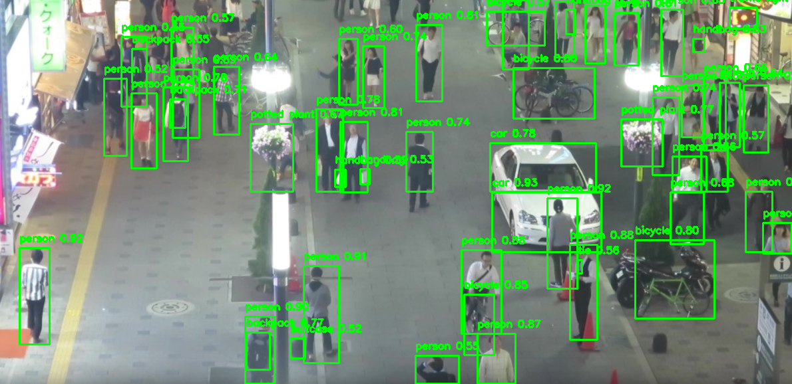

# RT-DETR 프로젝트

RT-DETR 기반 객체 감지 프로젝트입니다. 이 프로젝트는 이미지를 4분할하여 객체를 감지한 후, 감지 결과를 원본 이미지와 비교하여 처리 성능을 평가합니다.

---

## **프로젝트 주요 기능**

1. **이미지 분할**:
   - 입력 이미지를 4분할하여 각 부분에 대해 모델 추론을 수행합니다.

2. **추론 병합**:
   - 분할된 이미지의 추론 결과를 원본 이미지 좌표계로 병합합니다.

3. **NMS(Non-Maximum Suppression)**:
   - 중복된 바운딩 박스를 제거하여 최종 결과를 도출합니다.

4. **비교**:
   - 원본 이미지를 모델에 직접 입력한 결과와 분할 후 병합한 결과를 비교합니다.

---

## **사용된 기술 및 라이브러리**

- **[Ultralytics](https://github.com/ultralytics/ultralytics)**: RT-DETR 모델 로드 및 추론.
- **OpenCV**: 이미지 처리 및 바운딩 박스 그리기.
- **NumPy**: 이미지 분할 및 수치 연산.
- **PyTorch**: RT-DETR 모델 실행.
- **Python 3.8+**

---

## **프로젝트 구조**

```plaintext
RT-DETR/
├── utils/
│   ├── __init__.py           # 유틸리티 패키지 초기화
│   ├── image_utils.py        # 이미지 분할 및 병합 관련 함수
│   ├── drawing.py            # 바운딩 박스 그리기 함수
│   └── nms_utils.py          # NMS 관련 함수
├── inference.py              # 메인 추론 스크립트
├── test_data/                # 테스트 이미지 저장 폴더
│   └── test.png
├── output/                   # 결과 저장 폴더
│   ├── raw_result.png        # 원본 이미지 추론 결과
│   └── processed_result.png  # 분할 후 병합된 추론 결과
├── requirements.txt          # 종속성 관리 파일
└── README.md                 # 프로젝트 설명 파일
```

## **설치 및 준비, 실행**
이미지/비디오는 ./test_data 경로에 있어야됩니다.
```
git clone <repository-url>
cd RT-DETR
pip install -r requirements.txt
python inference.py


## **결과 비교**

### **1. 원본 이미지 결과**
원본 이미지를 모델에 직접 입력하여 추론한 결과입니다. 원본 결과에서는 모델이 감지한 객체들이 그대로 표시됩니다.


_원본 이미지 추론 결과_

---

### **2. 분할 및 병합된 결과**
입력 이미지를 4분할한 후, 각 분할에 대해 모델 추론을 수행하고 병합한 결과입니다. 분할 및 병합 과정의 성능을 평가할 수 있습니다.


_분할 후 병합된 추론 결과_

---

### **3. 결과 비교**
- **Raw 결과**와 **Processed 결과**를 비교하여 다음을 확인할 수 있습니다:
  1. 감지된 객체의 수가 동일한지.
  2. 객체 위치가 정확하게 병합되었는지.
  3. 병합 과정에서 누락된 객체가 없는지.

---

**Note**: 결과 이미지/비디오는 `test_data/output/` 디렉토리에 저장됩니다.

## **라이센스**

MIT License

Copyright (c) 2024 Yeongjin Hwang

Permission is hereby granted, free of charge, to any person obtaining a copy
of this software and associated documentation files (the "Software"), to deal
in the Software without restriction, including without limitation the rights
to use, copy, modify, merge, publish, distribute, sublicense, and/or sell
copies of the Software, and to permit persons to whom the Software is
furnished to do so, subject to the following conditions:

The above copyright notice and this permission notice shall be included in all
copies or substantial portions of the Software.

THE SOFTWARE IS PROVIDED "AS IS", WITHOUT WARRANTY OF ANY KIND, EXPRESS OR
IMPLIED, INCLUDING BUT NOT LIMITED TO THE WARRANTIES OF MERCHANTABILITY,
FITNESS FOR A PARTICULAR PURPOSE AND NONINFRINGEMENT. IN NO EVENT SHALL THE
AUTHORS OR COPYRIGHT HOLDERS BE LIABLE FOR ANY CLAIM, DAMAGES OR OTHER
LIABILITY, WHETHER IN AN ACTION OF CONTRACT, TORT OR OTHERWISE, ARISING FROM,
OUT OF OR IN CONNECTION WITH THE SOFTWARE OR THE USE OR OTHER DEALINGS IN THE
SOFTWARE.